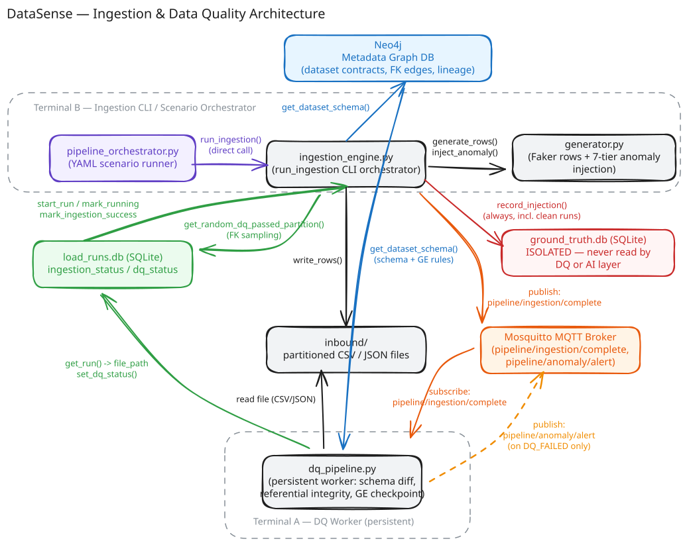

# DataSense

**A metadata-driven, semantic data quality investigation engine.**

Traditional DQ tools tell you *what* broke: `transactions.account_id has a
94% null rate`. DataSense exists to eventually answer *why* — tracing a
symptom back to its true root cause across datasets and time, using a
metadata graph of how those datasets relate to each other.

This repo currently implements the **deterministic foundation** (ingestion + data quality). 
The **AI investigation layer** is the next phase — see below.



---

## What's Actually Happening Here

Think of this as a small, controllable stand-in for a real production data
platform, built specifically so the eventual AI layer has realistic
incidents to investigate.

**In a real production system:** data lands continuously from upstream
sources into a lake or warehouse, partitioned by date. As each batch
arrives, a data quality gate checks it against a schema registry —
types, nullability, business rules, and whether foreign keys still resolve
against tables it depends on. A failure fires an alert (PagerDuty, Slack,
whatever), and an engineer starts digging through dashboards, catalogs, and
commit history to figure out what actually happened.

**Here, the same shape, made reproducible:**
- A **metadata graph (Neo4j)** plays the role of the schema registry —
  column contracts, business rules, and the relationships between
  `Customer → Account → Transaction`.
- A **generator** produces synthetic but relationally consistent data to
  stand in for real upstream systems.
- **Anomalies are injected on demand, parameter-driven** — the same kinds
  of things that break real pipelines for mundane reasons (an unannounced
  schema rename, a partial load, a silent volume drop) — so incidents can be
  manufactured and replayed instead of waited for.
- A **DQ worker** plays the role of the automated quality gate, validating
  each batch and publishing pass/fail verdicts over an event bus (MQTT here,
  standing in for something like SNS or Kafka in a real system).

Everything up to this point is **deterministic — no AI involved**. It
answers "what broke" exactly the way a production DQ tool does today, and
it's deliberately built to know its own limits: some of the anomalies this
system generates (statistical drift, multi-dataset cascades) *pass* every
deterministic check by design, because catching them isn't a rules problem.
See `examples/README.md` for a worked breakdown of exactly where DQ is
sufficient and where it structurally can't be.

---

## What I am Building Next: The AI Investigation Layer

A real on-call engineer doesn't stop at the alert — they ask *why*, and
often the answer is several hops and several hours away from the symptom.
Deterministic DQ has no mechanism for that; it checks one file against one
contract at one point in time.

The next phase is an investigation agent (built on LangGraph) that picks up
exactly where the deterministic layer stops: given an alert, it gathers
context in parallel — dataset profiles, lineage, historical baselines —
reasons across that evidence to trace the actual root cause even when it
sits in a different dataset and an earlier point in time, generates ranked
hypotheses with confidence scores rather than a single guess, and proposes
a remediation plan for a human to approve.

It's explicitly not meant to replace what's already built — the simpler
anomaly classes here don't need AI at all, and part of the exercise is
being honest about that. It exists for the cases this repo can already
produce but cannot explain on its own.

---

## Quickstart 

```bash
uv sync
```

**1. Bring up infrastructure (Neo4j + Mosquitto):**
```bash
cd datasense/infra
docker-compose up -d
docker-compose ps   # confirm both containers are healthy
cd ../..
```

**2. Load the metadata contracts into Neo4j (once):**
```bash
uv run python -m datasense.metadata.load_contracts
uv run python -m datasense.metadata.verify_contracts
```

**3. Initialize local storage (SQLite):**
```bash
uv run python -m datasense.storage.init_storage
```

**4. Start the DQ worker — left running in its own terminal:**
```bash
uv run python -m datasense.dq.dq_pipeline
```

**5. In a second terminal, we can generate the baseline data:**
```bash
uv run python -m datasense.orchestration.pipeline_orchestrator \
  --scenario datasense/scenarios/positive_baseline_chain.yaml
```

we will see `DQ_PASSED` for all three datasets in the DQ worker's
terminal. At that point the system is fully set up and queryable.

**Explore further:**
- `datasense/scenarios/` — every anomaly scenario (7 tiers + cascades),
  runnable the same way via `pipeline_orchestrator.py`
- `datasense/examples/` — small, hand-written before/after data samples with
  plain-English explanations of what each scenario does and why DQ reacts
  the way it does