```mermaid

sequenceDiagram
    autonumber
    actor Dev as Developer / execution context
    participant ING as ingestion::ingest_log_file
    participant VOPS_P as vector_ops::parse_log
    participant LC as LangChain (RecursiveCharacterTextSplitter)
    participant CHROMA as ChromaDB Collection
    participant HF_HUB as Hugging Face Hub (Cloud Cache)

    Note over Dev, ING: Phase 1: Ingestion Trigger
    Dev->>ING: Calls with ("path/to/spark_executor.log")
    ING->>VOPS_P: Passes filepath to extraction engine
    
    Note over VOPS_P, LC: Phase 2: Structural Clean & Smart Chunking
    VOPS_P->>VOPS_P: Reads file into memory & runs fast CRITICAL_KEYWORDS scan
    alt 0 Anomaly Footprints Identified
        VOPS_P-->>ING: Returns empty list []
        ING-->>Dev: Logs "Skipping file: No error footprints detected."
    else Error Keywords Present
        VOPS_P->>LC: Sends raw log text string to text_splitter.create_documents()
        Note over LC: LangChain splits logs safely using separators [\n, " | ", " "]
        LC-->>VOPS_P: Returns list of LangChain Document objects (< 1200 chars each)
    end

    Note over VOPS_P, CHROMA: Phase 3: Metadata Extraction & Schema Mapping
    loop For Each LangChain Document Chunk
        VOPS_P->>VOPS_P: Regex extracts Timestamp & Log Level (ERROR/WARN)
        VOPS_P->>VOPS_P: Drops standard INFO text fragments to eliminate vector noise
        VOPS_P->>VOPS_P: Compiles entry mapping into Chroma standard {"id", "document", "metadata"}
    end
    VOPS_P-->>ING: Returns list of formatted candidate dictionaries

    Note over ING, HF_HUB: Phase 4: Vector Generation & Storage Ingestion
    rect rgb(30, 40, 50)
        ING->>CHROMA: Calls collection.upsert(ids, documents, metadatas)
        Note over CHROMA: Chroma intercepts text fields via hf_embedding_fn
        CHROMA->>HF_HUB: Requests mathematical token vector arrays (Checks local cache first)
        HF_HUB-->>CHROMA: Returns 384-dimensional dense float vector embeddings
        CHROMA->>CHROMA: Indexes arrays into local disk using Cosine Similarity Distance Model
    end
    
    CHROMA-->>ING: Upsert transactional confirmation
    ING-->>Dev: Logs "Successfully ingested X anomaly segments."

```

```mermaid
sequenceDiagram
    autonumber
    actor Load Log main.py
    participant V1 as v1_react::run_v1_react_agent
    participant OAI as OpenAI (gpt-5-mini)
    participant MAPS as error_maps::lookup_known_error
    participant V_OPS as vector_ops::query_vector_store
    participant V1_SEV as v1_react::classify_severity
    participant V1_SIG as v1_react::extract_error_signature
    participant JUDGE as v1_react::evaluate_agent_output
    participant OAI_G5 as OpenAI (gpt-5)

    %% Phase 1: Execution Initialization
    Note over Dev, V1: Phase 1: Diagnostics Initialization
    Dev->>V1: Calls with (raw_log, max_iterations)
    
    %% Phase 2: ReAct Core Analytical Processing Loop
    rect rgb(30, 40, 50)
        Note over V1, OAI: Phase 2: ReAct Thought-Action-Observation Loop (Up to max_iterations)
        loop Continuous Iterations
            V1->>OAI: Submits Message Stack to determine next Action
            OAI-->>V1: Returns Thought and Selected Action String
            
            alt Action contains 'extract_error_signature'
                V1->>V1_SIG: Executed locally using Regex processing
                V1_SIG-->>V1: Returns {"error_signature": sig}
            else Action contains 'lookup_known_error'
                V1->>MAPS: Matches signature against static mappings
                MAPS-->>V1: Returns {"category": cat, ...} 
                Note over V1, MAPS: Calls error_maps::get_infrastructure_fix inside step logic
            else Action contains 'query_vector_store'
                V1->>V_OPS: Submits raw query text parameter
                V_OPS-->>V1: Returns {"historical_matches": [...]}
            else Action contains 'classify_severity'
                V1->>V1_SEV: Evaluates log context for risk tiers
                V1_SEV-->>V1: Returns {"severity": tier, "impact": text}
            end
            
            V1->>V1: Appends Result as an 'Observation' token to messages context
        end
    end

    %% Phase 3: Extraction and Compiling Final State
    Note over V1, OAI: Phase 3: Structured Answer Compilation
    V1->>OAI: Enforces closure pass ("STOP_AND_COMPILE") with FINAL_ANSWER_SCHEMA
    OAI-->>V1: Returns verified structured diagnostic JSON dictionary
    V1-->>Dev: Sends structured final analysis object payload back to primary process

    %% Phase 4: Verification and Judging Pipeline
    Note over Dev, OAI_G5: Phase 4: Verification Judging Phase
    Dev->>JUDGE: Calls with (raw_log, diagnosis_dict)
    JUDGE->>OAI_G5: Submits JUDGE_PROMPT & JUDGE_SCORE_SCHEMA (No Temperature)
    OAI_G5-->>JUDGE: Returns validated integer score and text rationale JSON object
    JUDGE-->>Dev: Delivers final evaluation audit report dictionary

```

# SCENARIO: ABC's engineering team receives 10,000+ internal Spark job failure logs per week across EMR clusters. 

### L1 triage takes ~2 hours per engineer per day — reading stack traces, matching to known failure patterns, escalating. 

### GOAL:

I have to build a "Log Triage Agent" that can ingest a Spark failure log and return a structured diagnosis: 
   ** root cause category, confidence, recommended action, and whether human escalation is needed.

### IMPLEMENTATION KPI

v1: Manual ReAct — string parsing, explicit loop, *Expectation* Can be fragile but transparent
v2: Anthropic tool_use — structured, schema-enforced, production-grade

#### Constraints

- **Latency:** A triage result must return in under 10 seconds for interactive use. Async is fine for batch.
- **Cost:** Cannot send full 50KB log files to the LLM. Token budget per call: ~2,000 input tokens max.
- **Accuracy:** The agent must *not* hallucinate a root cause. Unknown = unknown. It must say so.
- **Tool use:** The agent must use at least one tool call (not just a prompt). Think about what tools a real triage agent would need.
- **Output schema:** The response must be structured JSON, not free text. Downstream systems consume it.
- **Safety:** If the agent is >70% uncertain, it must route to a human. No silent failures.

---

## PRIMARY ERROR CATEGORIES

| # | Type | Root Cause Signal |
|---|------|-------------------|
| 1 | OOM | Heap exhaustion → cascade |
| 2 | S3 Access Denied | 403 on first read attempt |
| 3 | Schema Mismatch | decimal/string on `total_amount` |
| 4 | Lost Executor | RPC disassociation |
| 5 | Task Timeout | TaskKilled after 120000ms |

---

## TRAINING DATA and VECTOR DB Operation

---

## REACT AGENT FUNCTION CALLING

