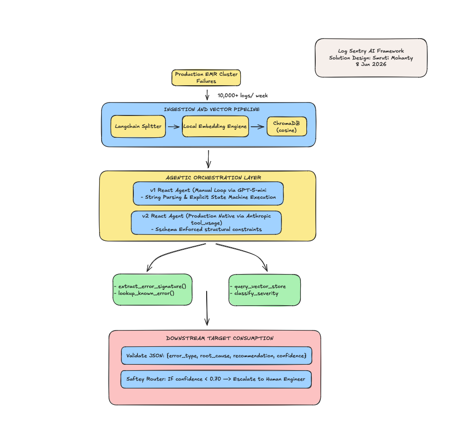
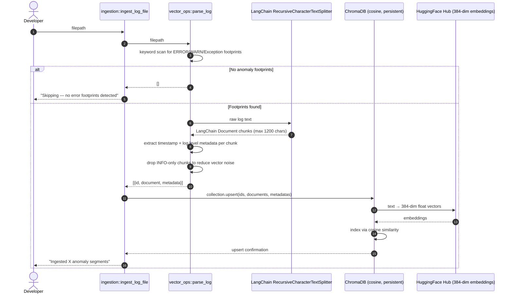

# Automated EMR/Spark Log Triage Agent: Technical Architecture Document

## Project Objective

The ABC engineering ecosystem executes high-throughput distributed workflows generating over 10,000 internal Apache Spark job failures weekly across production Amazon EMR clusters. Manual L1 triage currently consumes approximately 2 engineering hours per team member daily. This process relies on repetitive tasks: parsing multi-line Java/Scala stack traces, matching signatures to legacy runbooks, and routing escalations.
This project implements an Automated Log Triage Agent designed to ingest raw Spark/YARN container failure logs and output an instantly actionable, schema-enforced diagnostic payload.

                        
---

## Technical KPIs & Implementation Targets
This project evaluates two structural variations of the agent loop:

* v1: Manual ReAct (Deterministic Iteration): Built using an explicit string-parsing text loop driven by gpt-5-mini. It acts as a transparent, auditable state machine where tool selection is extracted via regular expressions.
* v2: Native Tool Use (Production Grade): Leverages Anthropic’s structured tool_use schema arrays to enforce strict JSON compliance at the model compilation boundary.

---

## AGENT FLOW V1 (Manual Parsing and Tool calling)

To establish a solid technical foundation, the initial development iteration bypasses high-level orchestration abstractions (such as LangChain Agent runtimes or Anthropic's native tool_use APIs) in favour of a bare-metal, loop-driven state machine.Building the core execution engine manually surfaces the critical low-level mechanics that commercial frameworks abstract away: message-history pruning, state preservation, raw text parsing, deterministic tool contract alignment, and string-boundary loop termination. Developing this transparent, auditable base layer guarantees that the subsequent shift to an production-grade agent is defensible, measurable, and structurally grounded.

The companion technical brief documents the iterative design choices, failure modes, and optimization steps encountered while testing the manual runtime:

Solution Design: [V1_REACT_AGENT.md](V1_REACT_AGENT.md)

Manual ReAct Agent : [V1-REACT-RESPONSE](Agent-Responses/V1-REACT-RESPONSE)

---

## AGENT FLOW V2 (Anthropic Tool Usage)

v2 replaces prompt-level hacks with protocol-level enforcement using Anthropic's native tool_use API.

*Both the Agentic Flow was tested on the below sample data that contains Disk Issue and Dynamo Access issue as outliers and should trigger Human Escalation as its not captured in Vector DB semantics.

Anthropic ReAct Agent : [V2_REACT_AGENT.md](V2_REACT_AGENT.md)

---

## System Constraints & Engineering Guards

### 1. Latency Profile

* Target: Interactive diagnostic generation must resolve in under 10 seconds.
* Design Pattern: Heavy context preparation—including text token chunking and categorical dictionary lookups—runs in local memory before calling the model endpoint.

### 2. Context Windows & Token Budgets

* Target: Strict 2,000 input tokens max per inference loop call.
* Design Pattern: Raw log payloads often exceed 50KB. The system uses LangChain’s RecursiveCharacterTextSplitter combined with keyword-filtering rules to strip clean INFO lines. This preserves only critical exception signatures, preventing token bloat.

### 3. Accuracy & Guardrails

* Target: Zero ungrounded predictions (hallucinations).
* Design Pattern: If a signature does not match records in the local ChromaDB database or your custom error index maps, the model outputs unknown_exception_set.

### 4. Integration Specifications

* Target: At least one tool execution per diagnostic loop.
* Design Pattern: The agent interacts with four functional hooks:
* extract_error_signature() (Isolates error signatures using regex pattern matching).
   * lookup_known_error() (Checks your static error categories and fetches runbook solutions).
   * query_vector_store() (Searches historical logs in ChromaDB using local cosine similarity).
   * classify_severity() (Evaluates infrastructure risks, focusing on driver vs. executor OOM issues).

### 5. Downstream Target Schema

* Target: Clean JSON response strings matching downstream logging systems.
* Design Pattern: The system uses OpenAI Structured Outputs (json_schema) to guarantee the final payload always returns four exact fields:

{
  "error_type": "string",
  "root_cause": "string",
  "recommendation": "string",
  "confidence": 0.0
}

### 6. Safety Escalation Router

* Target: Safe routing of uncertain errors.
* Design Pattern: If the agent's confidence falls below 0.70 (70%), the pipeline triggers an alert flag. This stops automated fixes and safely escalates the traceback to a human engineer.

### Constraints

- **Latency:** A triage result must return in under 10 seconds for interactive use. Async is fine for batch.
- **Cost:** Cannot send full 50KB log files to the LLM. Token budget per call: ~2,000 input tokens max.
- **Accuracy:** The agent must *not* hallucinate a root cause. Unknown = unknown. It must say so.
- **Tool use:** The agent must use at least one tool call (not just a prompt). Think about what tools a real triage agent would need.
- **Output schema:** The response must be structured JSON, not free text. Downstream systems consume it.
- **Safety:** If the agent is >70% uncertain, it must route to a human. No silent failures.

---

## PRIMARY ERROR CATEGORIES

- Vector DB captures follows

| # | Type | Root Cause Signal |
|---|------|-------------------|
| 1 | OOM | Heap exhaustion → cascade |
| 2 | S3 Access Denied | 403 on first read attempt |
| 3 | Schema Mismatch | decimal/string on `total_amount` |
| 4 | Lost Executor | RPC disassociation |
| 5 | Task Timeout | TaskKilled after 120000ms |

- Not captured in Vector DB, Lookups, Or Error Maps, To test against hallucination

| # | Type | Root Cause Signal |
|---|------|-------------------|
| 1 | Disk Space | IOException: No space left on device  |

---

## INGESTION

Training Data: [training_data](log_samples/training_data)

For generating Training Data: [GENERATE_TRAINING_DATA.md](log_samples/GENERATE_TRAINING_DATA.md)

*The Disk & Dynamo Issue  are left uningested to test agent response on un-chattered waters, to trigger Human Escalation route rather than agent hallucinative responses.* 

---

## Ingestion Pipeline

---

Test Inputs: [sample-test-data](sample-test-data) *The Disk & Dynamo Issue is deliberately left untrained to test agent response on un-chattered waters, to scope in the hallucination blast radius* 

| Log | v1 Judge Score | v2 Judge Score | known_match | escalate |
|-----|----------------|----------------|-------------|----------|
| OOM | 4              | 4              | Yes         | False    |
| S3 Access Denied | 5              | 4              | Yes         | False    |
| Schema Mismatch | 5              | 5              | Yea         | False    |
| Lost Executor | 3              | 5              | Yes         | False    |
| Disk Space (unknown) | 3              | 4              | No          | True     |

---
