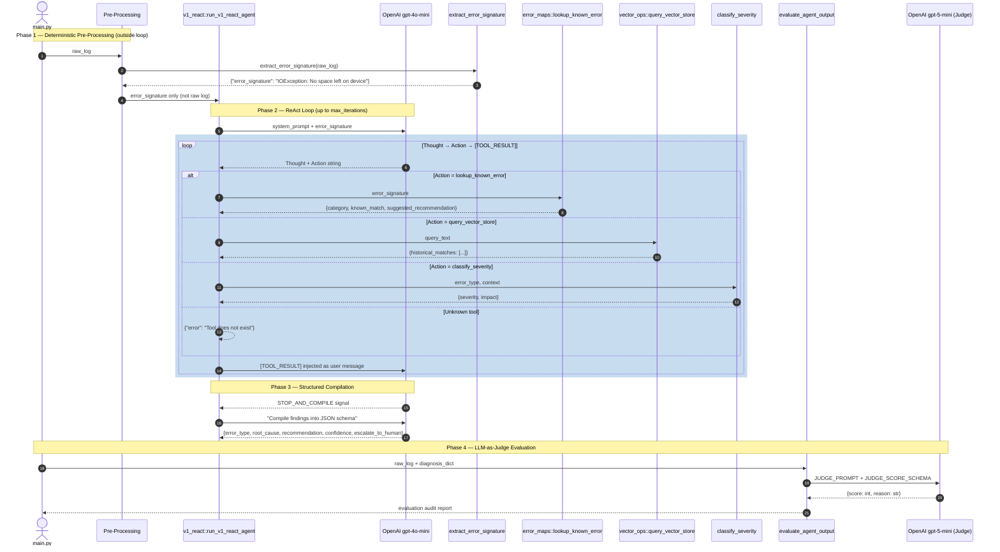

# Log Sentry — EMR Spark Log Triage Agent

> **v1: Manual ReAct** | Python · OpenAI · ChromaDB · HuggingFace

---

## Problem

AWS provides broad observability — but not at the domain-specific depth that enterprise-scale data platforms require. Organisation-specific orchestration layers, dataset patterns, and failure signatures are invisible to generic tooling. L1 triage of Spark/EMR failures is manual, slow, and inconsistent. This agent encodes institutional knowledge into a structured reasoning pipeline that triages, categorises, and escalates Spark failures — without human intervention for known error patterns.

---

## Architecture Decision: Why Manual ReAct First

Frameworks like LangChain and the tool_use API abstract away the ReAct loop. Building it manually first forces every design decision into the open — message history management, tool contract design, observation injection, loop termination. You cannot debug what you do not understand. v1 is the foundation that makes v2 defensible.

---

## What I Built

- **Ingestion pipeline** — keyword-filtered log chunking → HuggingFace embeddings (384-dim) → ChromaDB with cosine similarity index
- **Error index** — deterministic reverse-lookup map for known Spark failure signatures (O(1) keyword match)
- **4 agent tools** — `extract_error_signature`, `lookup_known_error`, `query_vector_store`, `classify_severity`
- **Manual ReAct loop** — string-parsed Thought/Action/Observation cycle with `STOP_AND_COMPILE` termination signal
- **Structured output** — JSON schema enforcement on final diagnosis via `response_format`
- **LLM-as-judge** — second model evaluates diagnosis quality with independent scoring rubric
- **Human escalation gate** — `escalate_to_human: true` + `confidence < 0.5` enforced on unknown error categories

---

## Iteration Log — Bugs Found and Fixed

| # | Bug | Root Cause | Fix | Lesson |
|---|-----|-----------|-----|--------|
| 1 | Agent fabricated tool observation for unknown disk space error | LLM pattern-matched `Observation:` label in its own prior output and generated a confident result | Changed injection role to `[TOOL_RESULT]` prefix; added explicit ground-truth constraint to system prompt | The ReAct loop is a negotiation — the LLM will fill silence with hallucination |
| 2 | `extract_error_signature` received literal string `"log_text"` as argument | System prompt used `log_text` as parameter name; LLM treated it as the literal value to pass | Moved extraction outside the loop as deterministic pre-processing; agent receives signature only | Deterministic steps do not belong inside a non-deterministic loop |
| 3 | Full raw log embedded in message history on every iteration | LLM was passing full log as tool argument; each iteration appended it to context | Pre-extract signature before loop; pass only the signal, not the source | Token cost scales with message history — instrument it early |
| 4 | Regex returned `IOException` only — lost `"No space left on device"` message | Pattern stopped at first whitespace; stripped the diagnostic signal | Updated pattern to `[a-zA-Z0-9_.]+(?:Exception\|Error)[^\n]*` — captures full line | Exception class alone is ambiguous; the message is the triage signal |
| 5 | Agent invented non-existent tool `escalate_to_human[true]` | LLM reasoned its way into wanting a capability not in the tool schema | Encoded escalation as a schema field in structured output, not a tool | In manual ReAct, the LLM can hallucinate tools — tool_use API prevents this at protocol level |
| 6 | Judge scored confident hallucination as 5/5 | Judge evaluates answer quality, not reasoning path integrity | Known limitation — judge cannot inspect intermediate tool results | LLM-as-judge measures output correctness, not process honesty |

---

## v1 Known Limitations

- **Brittle observation injection** — prompt-level constraint, not protocol-level enforcement
- **Tool hallucination risk** — LLM can invoke tools that don't exist
- **Judge blind spot** — cannot detect hallucinated intermediate reasoning steps
- **Static error index** — new failure patterns require manual keyword addition
- **`unknown_exception_set` recommendation too generic** — escalation message lacks domain-specific fallback actions
- **Severity classifier incomplete** — disk space and executor loss return LOW by default

---

## Agent Flow — v1 Manual ReAct

---

## What v2 will Fix

| v1 Limitation | v2 Solution (Anthropic `tool_use`) |
|--------------|-----------------------------------|
| LLM ignores injected tool results | API enforces tool result as typed input — LLM cannot override it |
| LLM invents non-existent tools | Schema defines available tools — invention is structurally impossible |
| Brittle string parsing of Action | Tool call is a structured API object — no regex required |
| Observation injection via prompt hacks | `tool_result` role is a first-class message type in the API |

---

*v2 (Anthropic tool_use) — in progress*