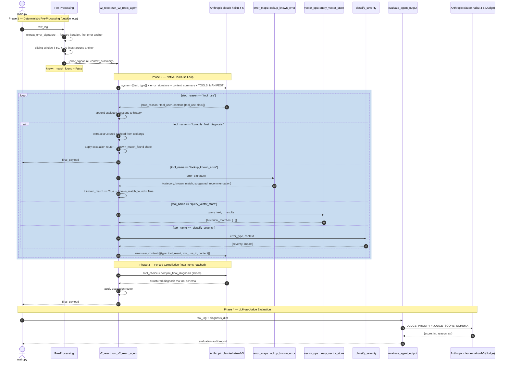

# Log Sentry — EMR Spark Log Triage Agent (Anthropic tool use)

> **v2: Anthropic Native Tool Use** | Python · Anthropic SDK · ChromaDB · HuggingFace

---

## Context

v1 established the manual ReAct loop from first principles — string parsing, observation injection, brittle loop control. Every fragility in v1 was deliberate: building manually first makes the abstractions in v2 defensible. See [README.md](./README.md) for the full v1 breakdown.

v2 replaces prompt-level hacks with protocol-level enforcement using Anthropic's native `tool_use` API.

---

## V2 Agent Response on Known and Unknown Error

[V2-ANTHROPIC-TOOL-USE-RESPONSE](Agent-Responses/V2-ANTHROPIC-TOOL-USE-RESPONSE)

--- 


## What Changed in v2

| Concern | v1 | v2 |
|---------|----|----|
| Tool contract | Regex string parsing | Structured API object |
| Tool result injection | `role: user` string hack | `role: tool_result` first-class message |
| Loop termination | `STOP_AND_COMPILE` string signal | `stop_reason == "end_turn"` |
| Invented tools | Possible — LLM can hallucinate tool names | Impossible — schema enforced at API level |
| Output schema | `response_format` JSON schema on final call | `compile_final_diagnosis` tool enforces schema |
| Escalation enforcement | Prompt instruction (unreliable) | Programmatic `known_match` flag (guaranteed) |

---

## Iteration Log — Bugs Found and Fixed

| # | Bug | Root Cause | Fix | Lesson |
|---|-----|-----------|-----|--------|
| 1 | `extract_error_signature` returning symptom not root cause | Iterating backwards found the last error — the terminal symptom, not the initiating failure | Changed to forward iteration — first error anchor with sliding window (-50, +100 lines) | The cascade reads chronologically — always march forward to find the cause |
| 2 | `known_match` not enforcing human escalation | `unknown_exception_set` category made the agent treat the error as located and valid — `escalate_to_human` stayed false | Introduced `known_match_found = False` before loop; set `True` only on confirmed category match; programmatically override confidence and escalation after `compile_final_diagnosis` | Ground truth must be captured in code, not inferred from model output |
| 3 | `system` parameter 400 error on Haiku | System prompt passed as dict — Haiku requires array format | Changed to `system=[{"type": "text", "text": V2_SYSTEM_PROMPT}]` | Always verify model-specific API contract before assuming parameter formats are universal |
| 4 | Escalation condition never triggered | Checking `error_type == "unknown_exception_set"` — model correctly sets `error_type` to the actual exception class, so condition never matched | Changed condition to check `known_match_found` flag instead of model output field | Programmatic enforcement must be grounded in your own data pipeline, not the model's response |

---

## Agent Flow — v2 Anthropic Tool Use



---

## Key Architectural Decision: Programmatic Escalation Router

The model cannot be trusted to self-report uncertainty on errors outside its knowledge base — it will reason from log context and produce confident answers regardless. Escalation is therefore enforced programmatically after `compile_final_diagnosis` returns:

```python
if not known_match_found:
    final_payload["confidence"] = 0.4
    final_payload["escalate_to_human"] = True
```

This is a hard gate. The model's confidence score is overridden. The decision belongs to the pipeline, not the LLM.

---

*v1 Manual ReAct — [V1_REACT_AGENT.md](V1_REACT_AGENT.md)*

*Log Sentry Main Document - [README.md](README.md)*