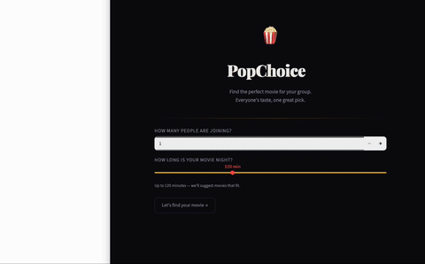

# 🍿 PopChoice

Find the perfect movie for your group. Everyone's taste, one great pick.

## Stack

- **Frontend:** Streamlit
- **Backend:** FastAPI
- **Embeddings:** OpenAI text-embedding-ada-002
- **Vector DB:** Supabase pgvector
- **LLM:** OpenAI gpt-4o-mini
- **Deploy:** Docker Compose

## Demo



## Project Structure

```
popchoice/
├── backend/
│   ├── main.py              # backend
│   ├── requirements.txt
│   └── Dockerfile
├── frontend/
│   ├── app.py               # frontend
│   ├── requirements.txt
│   └── Dockerfile
├── docker-compose.yml
├── .env.example
└── README.md
```

## Quick Start

### 1. Clone and configure

```bash
git clone https://github.com/2spmohanty/AI
cd popchoice
cp .env.example .env
# Edit .env with your API keys
```

### 2. Run with Docker

```bash
docker compose up --build
```

- Frontend: http://localhost:8501
- Backend API: http://localhost:7070
- API docs: http://localhost:7070/docs

### 3. Run locally without Docker

**Backend:**
```bash
cd backend
pip install -r requirements.txt
uvicorn main:app --reload --port 7070
```

**Frontend:**
```bash
cd frontend
pip install -r requirements.txt
# Edit API_URL in app.py to http://localhost:7070
streamlit run app.py
```


## User Flow

```
Landing page
     (number of people + duration)
Person 1 taste page
    - (favourite movie, mood, vibe)
Person 2 taste page  ← repeats for each person
    Next
Loading screen
    ------
Movie 1 result
     Next
Movie 2 result
     Next
Movie 3 result  (min 3, max 5)
     Start over / Home
```
