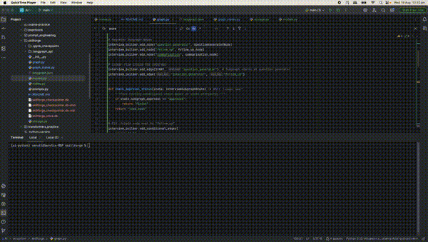

# SkillForge — AI Self-Assessment and Learning Path Generator

> **LangGraph Concepts Consolidation Project** | Python · LangGraph · OpenAI · Ollama · LangGraph Studio

---



## What This Is

SkillForge is a production-grade LangGraph agent that interviews a learner about any skill domain, identifies knowledge gaps through adaptive Socratic questioning, generates personalised learning paths via parallel AI workers, and remembers the learner across sessions. Built as a consolidation capstone covering every LangGraph module concept — from basic state graphs to deployment.

---

## Why This Is Genuinely AI

- **Adaptive questioning** — not a static questionnaire. The interviewer reasons over conversation history, covered subtopics, and known gaps to generate the next most diagnostic question.
- **Confidence-scored gap detection** — LLM-as-judge evaluates interview quality and triggers human escalation on low confidence.
- **Empathetic gap presentation** — raw evaluation rationale is humanised by a second LLM call before presenting to the learner.
- **Parallel path generation** — N gaps × 3 verticals = N×3 workers run simultaneously via `Send()`, each generating a targeted learning path.
- **Cross-session memory** — LangGraph Store persists learner profile, known gaps, and approved paths permanently across sessions.

---

## Architecture

```
learner input
      ↓
parent_init (reads long-term memory from LangGraph Store)
      ↓
interview_loop (subgraph — adaptive Socratic questioning)
  ├── question_generator → follow_up → question_generator (loop)
  └── summarisation (structured gap extraction at boundary)
      ↓
evaluation_node (LLM-as-judge + empathetic humaniser)
      ↓
gap_confirmation_node (interrupt — human confirms gaps)
      ↓
learning_path_dispatcher (Send() × N×3 workers)
      ↓
learning_path_worker × N (parallel map-reduce)
      ↓
candidate_path_node (LLM ranks paths by learner motivation)
      ↓
learning_path_approval_node (interrupt — human selects path)
      ↓
LangGraph Store write (persist approved path)
      ↓
END
```

---

## LangGraph Concept Map

| LangGraph Concept | Module | Where Applied |
|------------------|--------|---------------|
| `StateGraph` + `TypedDict` / Pydantic | 1 | `LearnerState`, `InterviewSubgraphState`, `LearningPathWorkerState` |
| Conditional edges | 1 | `check_approval_status`, `check_gap_confirmation_gate`, `learning_path_confirmation_gate` |
| State reducers | 2 | `add_messages` on interview history, `operator.add` on subtopics, custom `merge_paths_by_id` on candidate paths |
| Multiple schemas | 2 | Parent state, subgraph state, worker state — three independent schemas |
| `interrupt()` | 3 | `follow_up_node`, `gap_confirmation_node`, `learning_path_approval_node` |
| Dynamic breakpoints | 3 | Low-confidence escalation in `evaluation_node` — confidence < 0.8 triggers different confirmation prompt |
| Time Travel | 3 | `get_state_history()` — replay from any past checkpoint |
| Subgraph | 4 | Interview loop compiled independently, registered as node in parent graph |
| Parallelisation | 4 | N gaps × 3 verticals dispatched simultaneously via `Send()` |
| Map-reduce | 4 | `learning_path_dispatcher` fans out, `merge_paths_by_id` reducer merges, `candidate_path_node` ranks |
| `SqliteSaver` | 5 | Per-session checkpoint persistence — resume interrupted sessions |
| LangGraph Store (`SqliteStore`) | 5 | Cross-session learner profile — known gaps, approved paths, interests |
| Deployment | 6 | LangGraph Studio via `langgraph dev` — full graph visualisation and interactive execution |

---

## Key Design Decisions

**Why `interrupt()` not `interrupt_before`:**
`interrupt()` mid-node allows the node to build and pass the message as the interrupt payload — giving the human context before responding. `interrupt_before` would require the message to be pre-computed in state.

**Why two-phase `gap_confirmation_node` was avoided:**
Moving the humaniser LLM call into `evaluation_node` means `gap_confirmation_node` receives a ready-made message and simply interrupts — single responsibility, no phase tracking needed.

**Why `Send()` dispatcher is an edge function, not a node:**
`Send()` objects cannot be returned from a registered node — only from a conditional edge function. The dispatcher logic is inlined into `check_gap_confirmation_gate`.

**Why worker state is `TypedDict` not Pydantic:**
LangGraph passes `Send()` payloads as plain dicts to worker nodes. `TypedDict` aligns with this contract without requiring serialisation overhead.

**Why `merge_paths_by_id` not `operator.add`:**
Parallel workers can generate paths with the same `path_id` on retry. `merge_paths_by_id` uses last-write-wins per ID — preventing duplicates while preserving all unique paths.

**Deployment checkpointer:**
Local development uses `SqliteSaver` + `SqliteStore`. LangGraph Studio manages its own persistence — custom checkpointer and store are removed from `graph.py` for deployment, as the platform injects managed persistence automatically.

---

## Learning Verticals

Each detected gap generates three parallel learning paths:

| Vertical | Focus |
|----------|-------|
| `BROADER_CONCEPT` | How the concept connects to the ecosystem — mental models, related ideas |
| `JOB_READINESS` | Interview relevance, industry expectations, portfolio projects |
| `LEARN_BY_DOING` | Hands-on exercises, mini-projects, debugging tasks |

---

## Tech Stack

| Component | Technology |
|-----------|-----------|
| AI Orchestration | LangGraph |
| Interviewer LLM | OpenAI (temperature 0.8 — creative questioning) |
| Evaluation LLM | OpenAI (temperature 0.1 — consistent scoring) |
| Worker LLM | Ollama qwen2.5:7b — local, zero cost |
| Session persistence | SqliteSaver → `skillforge_checkpointer.db` |
| Long-term memory | SqliteStore → `skillforge_store.db` |
| Deployment | LangGraph Studio (`langgraph dev`) |

---

## Repo Structure

```
skillforge/
├── graph_states.py       # All state schemas — LearnerState, subgraph, worker
├── prompts.py            # All LLM prompts — interviewer, evaluator, ranker, humaniser
├── models.py             # LLM instances — question_model, eval_model, general_model
├── nodes.py              # All node functions — tagged with LangGraph concept
├── storage.py            # SqliteSaver + SqliteStore initialisation
├── graph.py              # StateGraph assembly + compiled graph export
├── langgraph.json        # Deployment config
└── README.md
```

---

## Bugs Found and Fixed

| # | Bug | Root Cause | Fix | Lesson |
|---|-----|-----------|-----|--------|
| 1 | LLM ignored injected tool results in v1 | `Observation:` label in assistant message confused next iteration | Changed injection to `[TOOL_RESULT]` prefix with explicit ground-truth constraint | The ReAct loop is a negotiation — LLM fills silence with hallucination |
| 2 | `extract_error_signature` received literal `"log_text"` | System prompt used parameter name as literal value | Moved extraction outside loop as deterministic pre-processing | Deterministic steps do not belong inside a non-deterministic loop |
| 3 | Duplicate gap display in Studio | LangGraph emits subgraph events at both subgraph and parent namespace | Node-name guards on every display block — each node owns its output | Never check payload content without checking node name first |
| 4 | `Send()` payload keys written to parent state | LangGraph treats all Send payload keys as state writes | Pre-format prompts in dispatcher — pass only `formatted_prompt`, not raw fields | Design Send payloads to contain only what the worker needs, nothing shared |
| 5 | `gap_confirmation_node` never showed message | `GraphInterrupt` swallowed at end of long stream chain | Detect interrupt via `snap.next` state check after stream completes | State inspection is more reliable than exception catching for interrupt detection |
| 6 | Worker received `LearnerState` instead of Send payload | Compiled subgraph registered in parent graph inherits parent state schema | Removed subgraph wrapper — registered worker as plain function node | `Send()` payloads work correctly only with plain function nodes, not compiled subgraphs |

---

## Running Locally

```bash
# Install dependencies
uv sync

# Run in notebook (development)
jupyter notebook skillforge.ipynb

# Run in LangGraph Studio (deployment)
langgraph dev
```

---

## Definition of Done

- [x] `LearnerState` schema justified field by field
- [x] Interview subgraph runs adaptive questions with covered subtopic tracking
- [x] Gap detection produces confidence-scored gaps with empathetic humanisation
- [x] SqliteSaver persists across terminal restarts
- [x] Map-reduce generates N×3 parallel learning paths
- [x] Human approval gate interrupts before saving path
- [x] LangGraph Store remembers learner across sessions
- [x] Time Travel replays past checkpoints
- [x] LangGraph Studio deployment running
- [x] Every node tagged with LangGraph concept applied
- [x] Pushed to GitHub with README